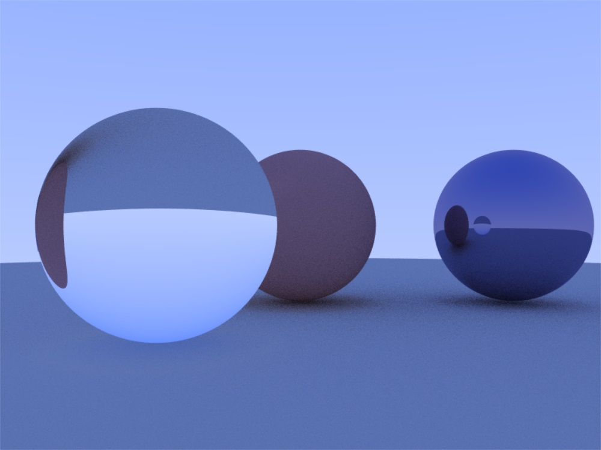
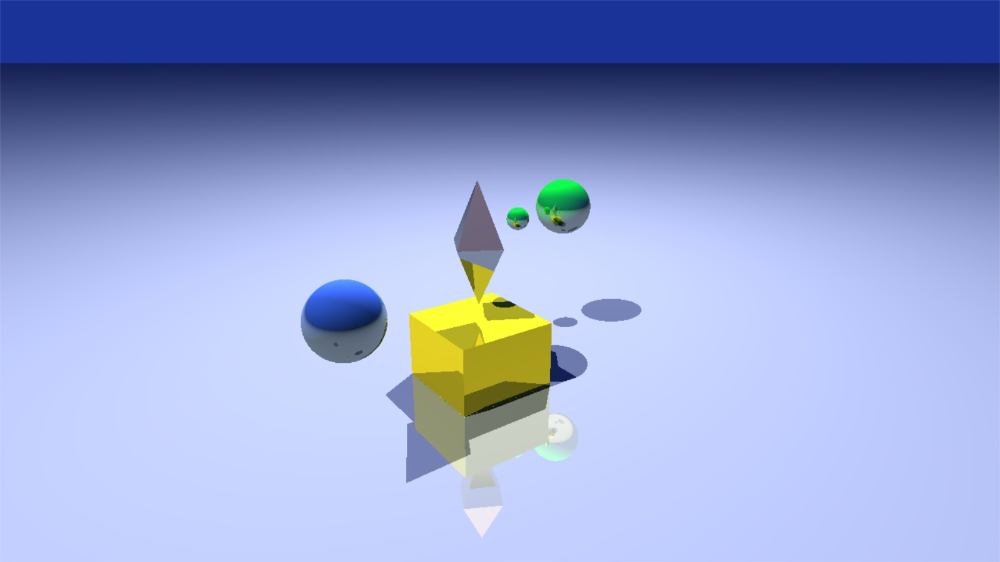

# Frag.py
A glsl shader toy on python

## Examples

Edge detection
```
python app.py -cfg config_edge.json
```


Ray tracing modified from https://github.com/MacgyverLin/GLSLRayTracer



Ray tracing modified from https://www.shadertoy.com/view/7t2XRm
